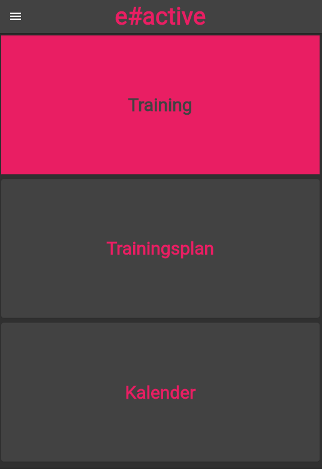
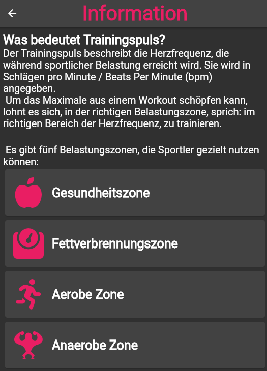
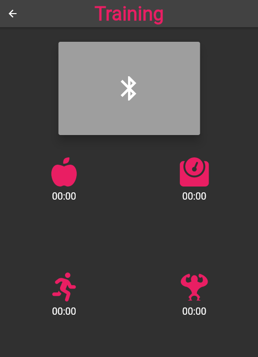

# Cosinuss-Sports

A Flutter App for android phones. It measures the heartrate with cosinuss wearables.
- [Cosinuss](https://www.cosinuss.com/en/)






## Getting Started

It is necessary to install Flutter and Android-Studio. A manual is available on the Flutter homepage:
[How to install Flutter and Android-Studio](https://docs.flutter.dev/get-started/install)

## To run the App:
```bash
flutter run --no-sound-null-safety
```